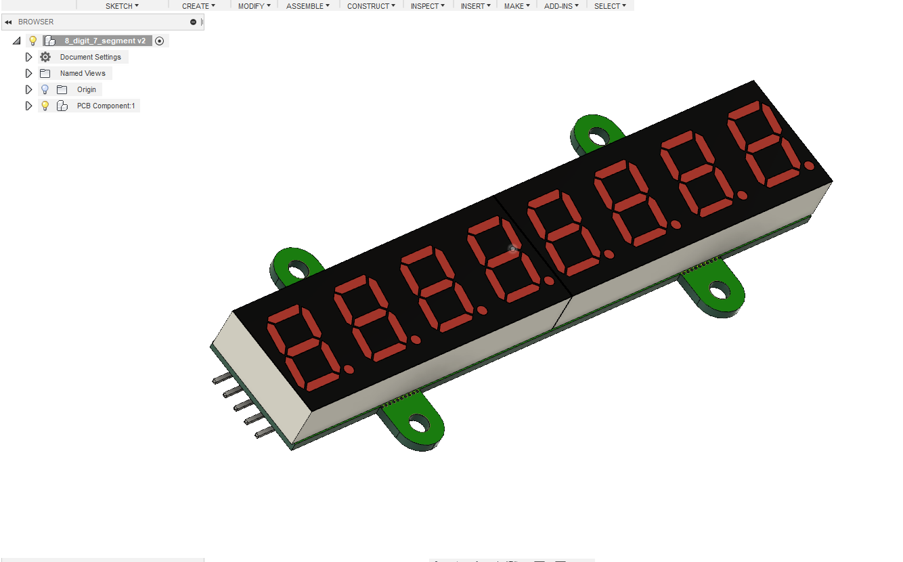

# max7219-driven-8-digit-7-segment-display-common-cathode
This is my first PCB that got manufactured A display driver module with Maxim's MAX7219CNG IC and two four digit seven segment displays. The design was made with Eagle and it was manufactured by JLCPCB.

The repository contains Arduino example codes, images of the PCBs and of the assembled module, Eagle schematic and board layout and gerber files. Some of the components are still missing from the 3D model so it's unavailable yet, but I'll upload to my Fusion360 [gallery](https://gallery.autodesk.com/fusion360/users/S2YAKSQZSPKT) as it's ready.
